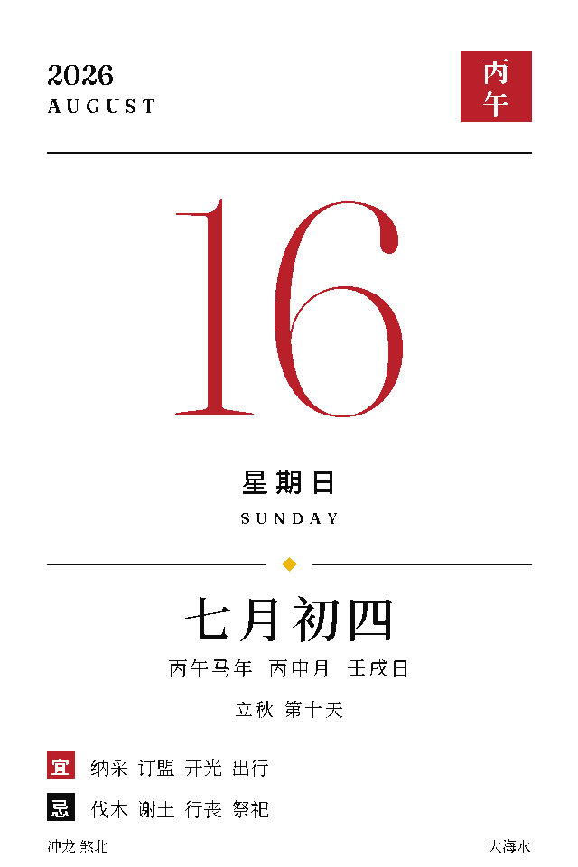

# Tylendar

A wall mounted daily Chinese almanac (huangli) on a 10.2 inch four color
e-paper panel, framed in an IKEA RODALM. Every night at midnight it tears
off yesterday and shows the new day: Gregorian date, lunar date, ganzhi
pillars, zodiac year, solar terms, festivals, and the daily yi and ji.



## How it works

1. A GitHub Action in this repo runs every night at 00:05 Singapore time.
   It renders the new day with Python and Pillow, quantizes it to the four
   panel colors, and commits `output/tylendar.bin` (153600 bytes, 2 bits
   per pixel) plus a `preview.png`.
2. An ESP32 behind the frame wakes from deep sleep at 00:20, joins WiFi,
   downloads the binary, and streams it straight to the panel. No frame
   buffer, no server, nothing to host.
3. The panel refreshes for about 20 seconds, then both the panel and the
   ESP32 go back to deep sleep for 24 hours.

## Hardware

| Part | Notes |
| --- | --- |
| Good Display GDEM102F91 | 10.2 inch, 960x640, black white yellow red, SSD2677 |
| Good Display ESP32-L kit | ESP32-WROOM-32D board with DESPI-C02 adapter |
| IKEA RODALM 21x30 frame | The included mat is trimmed to crop the screen |
| USB-C cable | The ESP32-L has no battery circuit, it is USB powered |

## Repo layout

```
generator/   Python renderer, fonts, run: python3 generator/generate.py
firmware/    Arduino sketch for the ESP32-L, panel driver included
output/      Rendered binary and preview, updated nightly by Actions
docs/        Flashing guide for macOS, hardware assembly guide
```

## Setup

1. Fork this repo (or use it as a template), then enable GitHub Actions
   on your fork. Run the "Render daily calendar" workflow once by hand so
   `output/tylendar.bin` exists.
2. Edit `firmware/Tylendar/config.h`: WiFi credentials and, if you forked,
   your own raw.githubusercontent.com URL.
3. Flash the firmware to the ESP32-L. Full walkthrough for macOS in
   [docs/FLASHING_MACOS.md](docs/FLASHING_MACOS.md).
4. Assemble the display, adapter, and frame. See
   [docs/ASSEMBLY.md](docs/ASSEMBLY.md), including the RESE switch
   position and mat cutting measurements.

## Renderer

`generator/generate.py` draws a 640x960 portrait page. All text is drawn
through thresholded masks so every pixel is exactly one of the four panel
colors; anti-aliased edges would otherwise quantize into speckle. Red is
reserved for Sundays, festivals, and the year seal. Yellow is used
sparingly: the solar term tag and one small diamond accent, since large
yellow fields render muddy on this film.

Render any date to check the layout:

```
python3 generator/generate.py 2027-02-06
```

The packed format matches the panel: rows of 960 pixels, 4 pixels per
byte, most significant bits first, 00 black, 01 white, 10 yellow, 11 red.

## Firmware

`firmware/Tylendar/epd_gdem102f91.cpp` is a small streaming driver whose
init sequence is transcribed from the official Good Display sample code
(AU-GDEM0102F91, 2024-02-01). It is not the generic SSD2677 sequence:
eight registers differ from the closest GxEPD2 driver, they are the
factory tuned booster and waveform values for this exact film.

The sketch never refreshes a partial download. If WiFi or the download
fails it leaves yesterday on screen and retries in an hour.

## Credits

Lunar calendar math by [lunar-python](https://github.com/6tail/lunar-python)
(MIT), verified against the Hong Kong Observatory conversion tables.

Fonts, all under the SIL Open Font License, bundled in
`generator/fonts/`:

- [Chiron Sung HK](https://github.com/chiron-fonts/chiron-sung-hk) for
  Chinese text, a Hong Kong Song style face in the spirit of the MTR
  signage typeface, subset to the characters the almanac can emit
  (see `generator/subset_fonts.py`)
- [Fraunces](https://github.com/undercasetype/Fraunces) for Latin text
  and the large date numeral
- Noto Sans SC for the small chip labels, same subset
